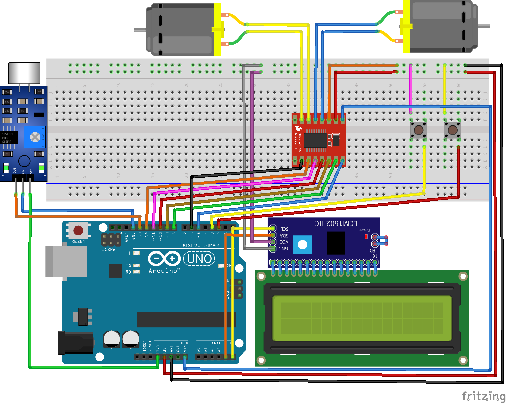

## Linh kiện
Mạch Arduino UNO R3\
Breadboard\
Cảm biến âm thanh CN-07\
Module điều khiển  TB6612FNG\
Động cơ DC (2 cái)\
Màn hình LCD tích hợp sẵn I2C\
Dây nối (dây 2 đầu đực và dây đực-cái)\
Nút bấm

## Lắp mạch

## Video Demo
https://www.youtube.com/watch?v=3PJ8Q2B-2QY