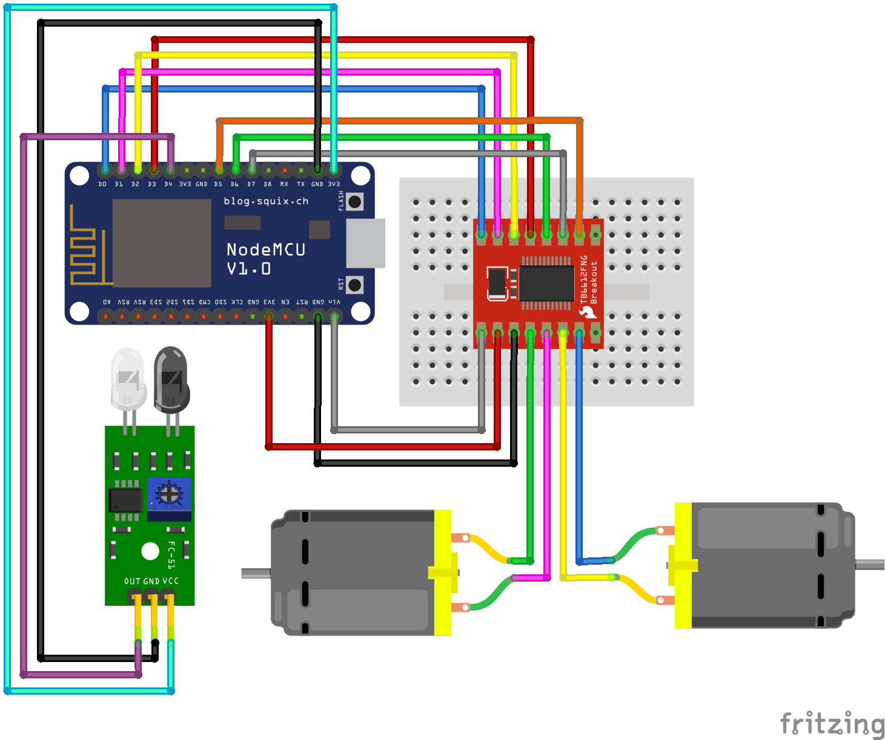

## Linh kiện
Mạch Arduino UNO R3\
Breadboard\
Cảm biến hồng ngoại vật cản MDL-291\
Kit RF Thu Phát Wifi ESP8266 NodeMCU Lua CP2102\
Module điều khiển  TB6612FNG\
Động cơ DC (2 cái)\
Dây nối (dây 2 đầu đực và dây đực-cái)\
Nút bấm

## Lắp mạch

## Video Demo
