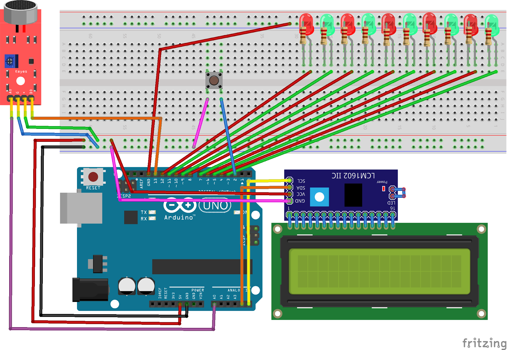

## Linh kiện
Mạch Arduino UNO R3

Breadboard

Cảm biến âm thanh KY-037

Màn hình LCD tích hợp sẵn I2C

Đèn Led

Dây nối (dây 2 đầu đực và dây đực-cái)

Điện trở

Nút bấm

## Lắp mạch

## Video Demo
https://www.youtube.com/watch?v=Jq_Delq7Fos