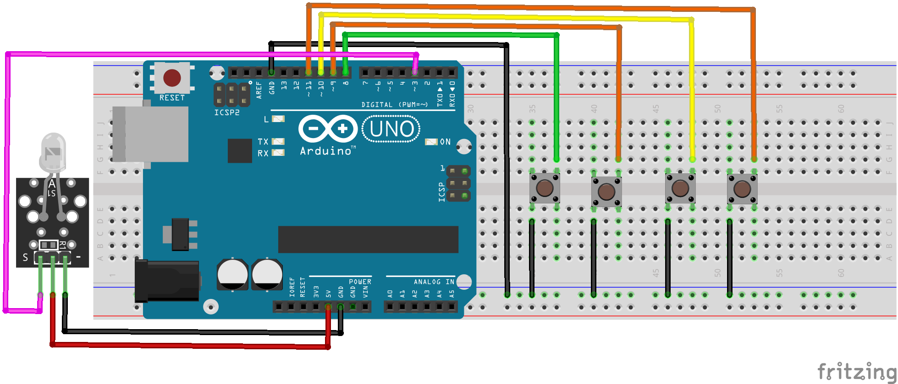
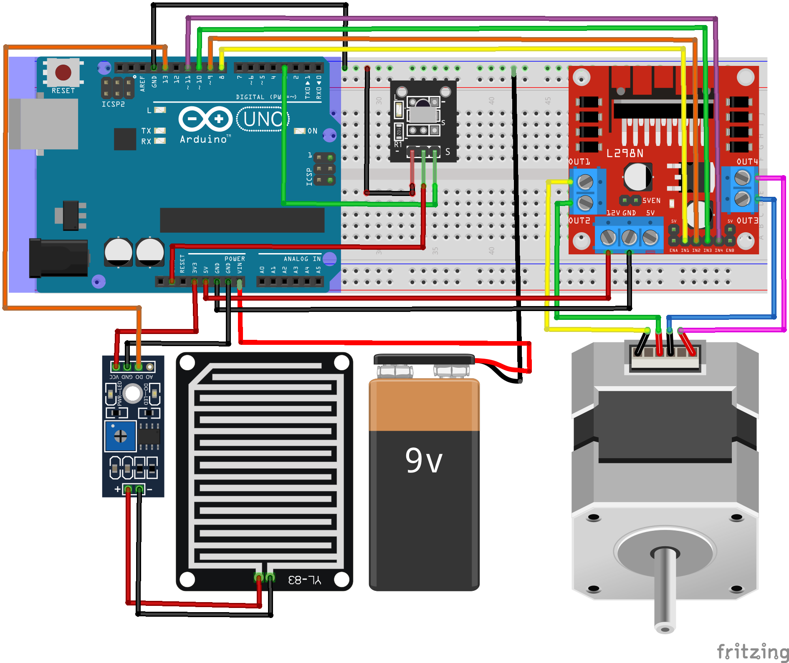

# Đề tài : Giếng trời thông minh

## Giới thiệu đề tài
Giếng trời thông minh là một hệ thống mái che tự động, được tạo ra nhằm mục đích che chắn khu giếng trời, hay còn gọi là thông tầng. Với mục đích để lấy gió, ánh sáng một cách chủ động và có thể điều khiển từ xa thông qua hồng ngoại, điện thoại di động, ...

## Linh kiện sử dụng
Arduino UNO R3 : 2 cái\
Breadboard : 2 cái\
Module phát hồng ngoại Ky-005 (1 - 2m) : 1 cái\
Module thu hồng ngoại Ky-022 (15m) : 1 cái\
Module điều khiển động cơ L298N : 1 cái\
Động cơ bước (1.8 độ) : 1 cái\
Cảm biến mưa : 1 cái\
Pin 9V : 1 cái\
Nút bấm : 4 cái\
Dây nối

## Nguyên lý hoạt động

### Mạch phát : 
Gồm có 4 nút nhấn gửi đi tín hiệu hồng ngoại với các chức năng : 
- Đổi chế độ (Tự động, thủ công) cho giếng trời
- Điều khiển giếng trời đóng/mở nếu đang ở chế độ thủ công
- Giảm tốc độ giếng trời
- Tăng tốc độ giếng trời

### Mạch thu : 
Gồm 2 chế độ (chuyển đổi bằng nút nhấn) : 
- Tự động : Đóng/mở giếng trời khi cảm biến mưa phát hiện có mưa/không mưa, không bị tác động bởi nút nhấn ở mạch phát.
- Thủ công : Đóng/mở giếng trời bằng nút nhấn ở mạch phát, không bị tác động bởi cảm biến mưa.

Động cơ bước quay 180 độ (100 bước) để đóng/mở giếng trời.

## Hướng dẫn nạp Code : 

### Cài đặt thư viện hỗ trợ module hồng ngoại:
Tải thư viện IRremote phiên bản 2 tại link sau : http://k2.arduino.vn/img/2014/08/04/0/702_8821-1407121936-0-arduino-irremote-master.zip

Nguồn (hiện đã cập nhật phiên bản 3 nhưng ta chỉ dùng phiên bản 2) : https://github.com/Arduino-IRremote/Arduino-IRremote 

Thực hiện Import thư viện vào Arduino IDE : 
Vào Sketch -> Include Library -> Add .ZIP Library và chọn đến file .zip của thư viện đã tải về

### Nạp Code vào Arduino
Sau khi lắp đặt các linh kiện đúng theo sơ đồ lắp mạch ở trong slide, ta tiến hành nạp code cho 2 mạch phát và thu bằng các file code trong thư mục source : 
- Code mạch phát : IR-Transmitter.ino
- Code mạch thu : IR-Receiver.ino

## Mạch phát

## Mạch thu

## Video Demo
https://youtu.be/EhuAgEDBQCE