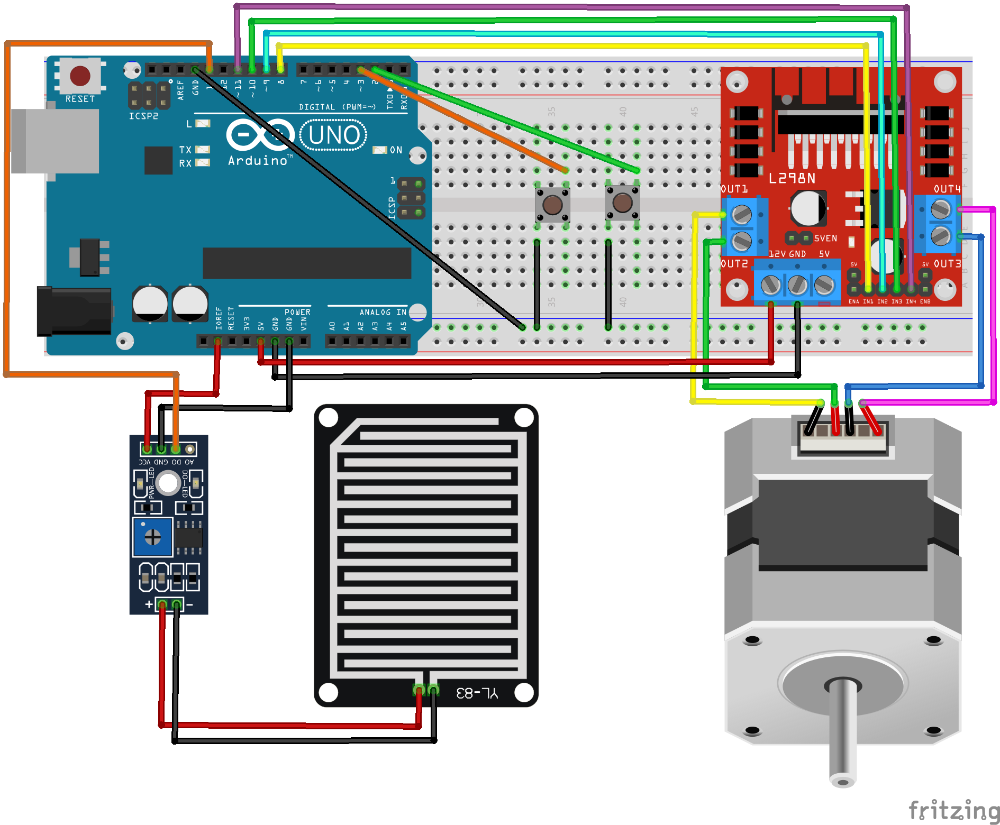

## Linh kiện
Mạch Arduino UNO R3\
Module điều khiển L298N\
Động cơ bước\
Breadboard\
Cảm biến mưa\
Dây nối (dây 2 đầu đực và dây đực-cái)\
Nút bấm

## Lắp mạch

## Video Demo
https://youtu.be/HStiE6TRT9A
